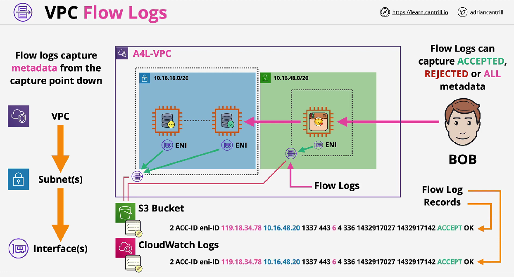
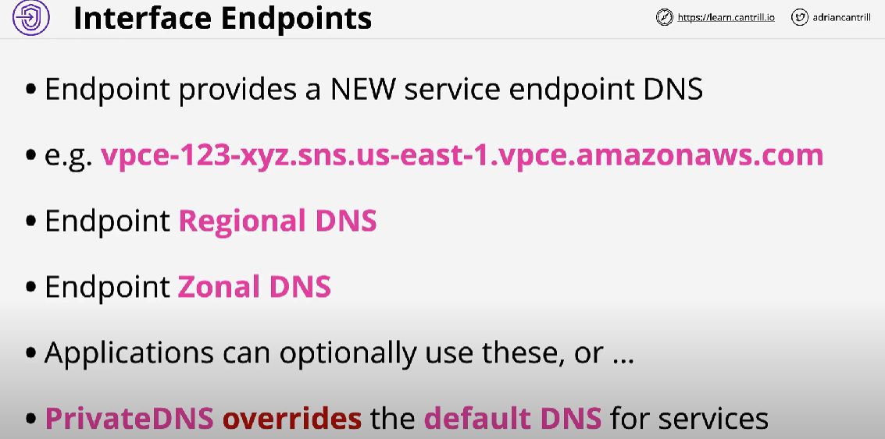

# Networking on AWS

## VPC Flow Logs

## Egress-Only Internet Gateway

## VPC Endpoints

### VPC Endpoint Gateway

#### Implementation

### VPC Endpoint Interface

???+ tip

    The **Endpoint Interface** uses **privatelink** to connect to the AWS Public services (EXCEPT DynamoDB). You can imagine that the privatelink allow external services to be injected in your VPC and be given network interface inside your VPC subnet.

#### Implementation

